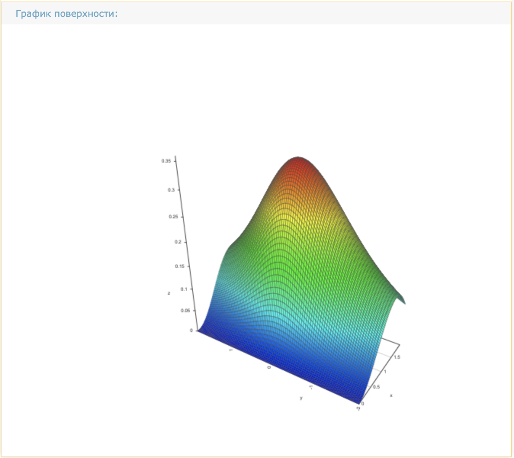
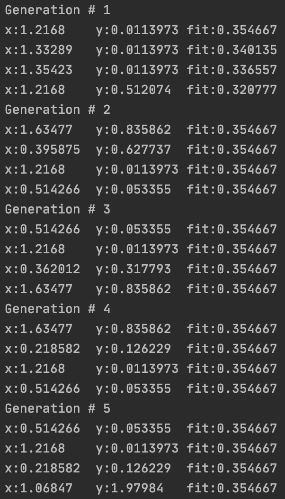
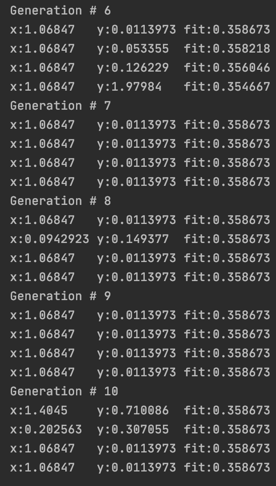

# Лабораторная работа №3
# Исследование генетических алгоритмов в задачах поиска экстремумов 
## Вариант 15

Цель работы - с помощью генетичексих алгоритмов вычислить приблизительно 
высшую точку (наибольшее значение по оси Z) заданной поверхности

# Уравнение поверхности:

# График ограниченной поверхности

# Результаты работы

